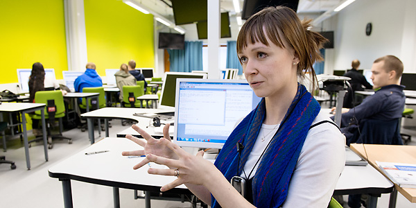

Copyright (c) 2019 OERCompBiomed - Open Educational Resources in Computational Biomedicine

# Introduction to Computational Biomedicine   and Machine Learning

This is the repository for the course cbm2: Introduction to Computational Biomedicine and Machine Learning. This repository is forked from [OERCompBiomed CBM101](https://github.com/oercompbiomed/CBM101) course and is modified for this course (cbm2). The original repository goes deeper in machine learning and has some more advanced exercises.

Here you find exercises, code and documentation for the course. 

# Quick Start
Follow the instructions in the [setup.md](./setup.md) file (you can also watch [this video](https://youtu.be/BF9OTam4nwk) that goes through the setup and optionally [this one](https://youtu.be/4KpD-L8-uZQ) first if you are new to working with command line). 

## Introduction

### *The big picture of CBM101*

CBM101 is part of the "Open Educational Resources in Computational Biomedicine"* (OERCompBiomed) project conducted by the NordBioMed.org and funded by [Erasmus+](http://ec.europa.eu/programmes/erasmus-plus/projects/eplus-project-details/#project/bc4e0bdb-aa64-4d5c-a7f2-26d68ec36647).

NordBioMed is a collaborative network in the field of Biomedicine(*) between the Universities of Turku, Eastern Finland (Kuopio), Bergen, Odense and Karolinska Institutet. The network was originally formed in 2013 to strengthen the individual biomedical teaching programs within the component universities and make them internationally more competitive by providing complementary activities from the partner universities. The network supports both student and teacher mobility, organises intensive courses and develops virtual online teaching and an information platform on the [Open edX](https://open.edx.org/) platform, supported by a GitHub repository.
Links that redirects to the study programme pages of each NordBioMed partner universities can be found [here](https://nordbiomed.org).

(*) Biomedicine covers those areas of human biology, chemistry and medicine that seek to explain the factors behind health and disease at the molecular and cellular level. This information is applied in the development of better diagnostics and treatments.

### What’s OERCompBiomed?

The Nordic network of Biomedicine educators NordBioMedNet has received a grant of 350 000 euros from Erasmus+ to develop biomedicine education. With the received money the network can start providing Open Educational Resource (OER) courses that are open for everybody. They will start by providing courses of Biomedical Ethics, Digital Pathology, Computational Biomedicine and machine learning.

The main objective of the project is to provide students in the field of biomedicine with modern, timely, up-to-date, and professionally relevant learning experiences that enable them to develop skills and competences in biomedical data management and use, and skills and competences to identify, analyse and handle ethical challenges within modern biomedicine.

As modern biomedical research produces massive data generated by high-throughput methods, students need to develop computational and analytical skills to manage and utilise “big data”. Moreover, knowledge and tools in bioethics are also increasingly important due to present rapid technological development in biomedicine with, for example, a new era of modern genomic/genetic research ripe with very critical and difficult ethical issues.  

[Excerpt from "Erasmus+ funding for development of Biomedical education" An interview with Merja Heinäniemi](https://www.uef.fi/en/-/erasmus-rahoitusta-biolaaketieteen-koulutuksen-kehittamiseen)

You can read more about OER in this [Foundations for OER Strategy Development](http://www.oerstrategy.org/home/read-the-doc/) document.

### Submodules in the "Introduction to Computational Biomedicine and Machine Learning":

- **Introduction**: Motivation to study computational methods in the life sciences. Index notebook with links to all excercise notebooks

- **Python and Friends**: Introduction to programming in Python and specialized libraries (Numpy and Pandas).

- **Data Resources**: Covers some basics of visualization and accessing datasets from online via Python.

- **Network Analysis**: Fundamental concepts in network science and application to real and toy biological problems. 

- **Machine Learning**: Unsupervised and supervised learning with applications to biological data analysis.

Inside each corresponding directory, you will find a set of interative notebooks with code material and exercises, each covering a specific subtopic. The order of the submodules is structured generally in an increasing level of difficulty, but there is no requirement to follow them in the given order. 

## Instructions for users

### Installation
You need to set up the Jupyter enrivonment on your computer or use one of the cloud options to run the exercise material. 

**Follow the instructions at [Setting up your system](setup.md) to get ready**

You will have to install different packages (mostly Python) in your system along the course. 

### Jupyter notebooks
The course is based on Jupyter Notebooks, a web-based framework for developing and presenting code-based projects (take a look at https://youtu.be/HW29067qVWk og https://youtu.be/2eCHD6f_phE for introductions to Jupyter Notebooks). You can read more about why scientists chose Jupyter notebooks here: https://www.nature.com/articles/d41586-018-07196-1

Throughout the course you will work with notebooks that contain various material and programming tasks. We recommend that you *make a copy of our notebooks before you are editing them*. In this respect you might adopt the naming convention `my_[name_of_notebook].ipynb`.

### Solutions to exercises  
Exercises inside of notebooks are provided with solutions, with an option to load these solutions using the `%load` magic command. Remove the ``#`` before the command and run the cell to load the answer.

   
